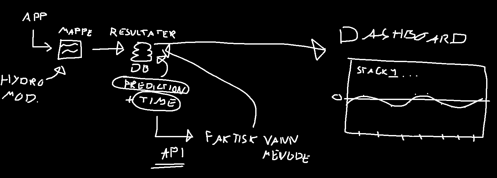

# Stack

Local: Docker Compose environment with LocalStack (mock AWS), Postgres, Redis, Celery, and FastAPI, all running in containers for easy dev/testing.

Production: Docker Compose environment on AWS ECS (Fargate) with Secrets Manager, RDS, ElastiCache (Redis), Celery, and FastAPI, plus EventBridge and CloudWatch for scheduling and monitoring.

# Overview

